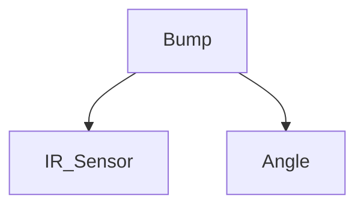
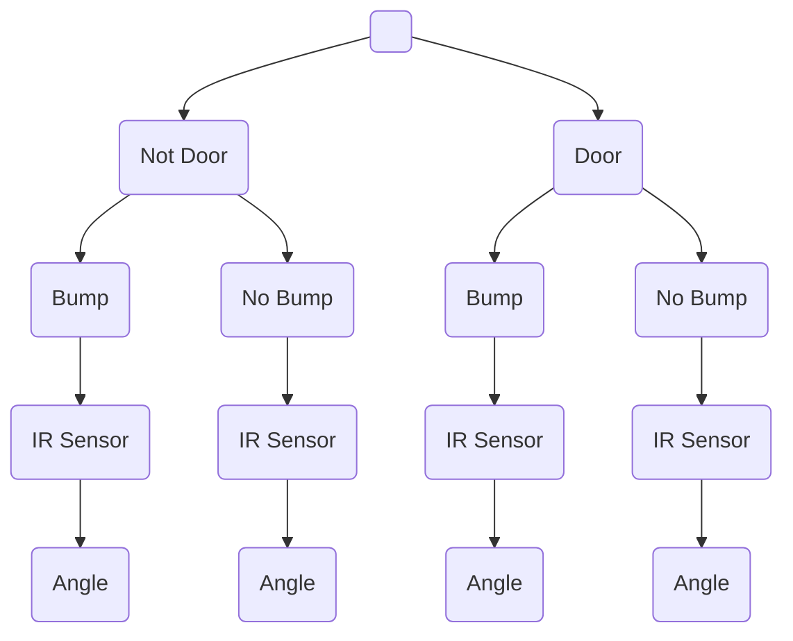
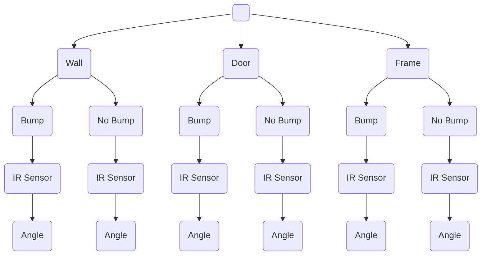

# CSE5694-IROBOT
Phi, Vamshi, Pawan

### Website link
https://vamshireddy7008.github.io/CSE5694-IROBOT/

## Bayesian Network Overview

A Bayesian Network (BN), also known as a Belief Network or Probabilistic Graphical Model, is a data structure that represents the probabilistic relationships among a set of random variables. Bayesian Networks are particularly powerful for modeling uncertainty and reasoning in complex systems, making them valuable in various fields like artificial intelligence, decision support, medical diagnosis, and robotics.

Conditional Probability Distribution (CPD):
Each node in the Bayesian Network has a corresponding Conditional Probability Distribution (CPD) that quantifies the relationship between the variable and its parents. If a node has no parents, the CPD is simply its marginal probability. For nodes with parents, the CPD describes how the probability of the node varies depending on its parents' states.

## Use of Bayesian Network in Robotics

In our project, we utilize a Bayesian Network for decision-making in a robot that must navigate and interact with its environment. Specifically, the Bayesian Network helps the robot determine whether it has just passed a door and calculate its current distance from the wall, based on sensor data.

# Project 1
## Problem statement
Implement a sensor fusion module based on a Bayesian Network whereby the robot, when moving along a wall using it's sensors, decides
(1)whether it has just passed by a door 10cm ago.
(2)what is it's actual distance from the wall (as a probability distribution)
(3)The CPTs should be learned from measurements/data (iCreates found with me)

## How the Network is Used on the Robot

Sensor Data Collection:
	The robot is equipped with multiple IR sensors that detect amount of infrared received bouncing light from the wall These sensors continuously collect data about the environment, such as distance to obstacles and the likelihood of detecting a door.
	The robot has built in gyroscopic sensors that allow it to read the angle that the robot is turning towards.
	The robot also has a sensor for when it bumps onto an object

Movement Control:
	The robot executes movement commands to adjust its trajectory. I tries to follow the wall and drive as perpendicular as possible. sensors can also be use to give feedback to the robot as it tries to follow the wall

Bayesian Network Integration:
	The sensor data is fed into the Bayesian Network as evidence. The network has nodes representing IR Sensor Data (IR), gyroscopic sensor data (angle), touch/contact sensor data (bump).

## Graph Representation of the Bayesian Network

## Algorithm Used 

The Bayesian Network is employed as part of a sensor fusion module that integrates information from multiple sensors to make probabilistic decisions. The key algorithms used are:

_Belief Propagation_: Used to infer the likelihood of certain states (e.g., presence of a door) based on evidence gathered by the robot's sensors. This allows the robot to continuously update its belief state about the environment.

_Value Iteration_: Used for planning. The probability estimates generated by the Bayesian Network feed into the value iteration process, which determines the probabilities that the robot has seen a door.

To calculate the probability that the robot has seen a door, we will use Bayes' Theorem.

    P(D| S=st, A=at, B=b)
    => P(S=st, A=at, B=b| D) * P(D)/P(S=st, A=at, B=b)                          *Bayes' Theorem*
    => P(S=st, B=b| D) * P(A=at, B=b| D) * P(D)/ (P(S=st, B=b) * P(A=at, B=b))  *Definition of Independence*
    where:
    D = event that the robot has past a door.
    S = IR sensor data.
    A = gyroscopic sensor data.
    B = touch/contact sensor data.

Time is also calculated using multiple readings as the robot moves along the wall. Each timestep, the robot stores the values of the data readings at that time up to specified amount of timesteps
    
    P(S=st, B=b| D) * P(A=at, B=b| D) * P(D)/ (P(S=st, B=b) * P(A=at, B=b))
    => P(S=st[1:n] ; B=bt[1:n]| D) * P(A=at[1:n]; B=bt[1:n]| D)/ (P(S=st[1:n]; B=bt[1:n]) * P(A=at[1:n]; B=bt[1:n]))

## Summary of the Code

The code for implementing the Bayesian Network in the robot involves several key components:

Network Structure Definition: The graph structure of the Bayesian Network is defined using Python libraries. The nodes and edges are specified to represent the relationships between sensor readings and robot actions. Conditional Probability Tables (CPTs): The CPDs for each node are defined based on prior data or expert knowledge. These CPTs quantify how likely each state is given its parent nodes. For example, the probability of detecting a door given the sensor readings. The graph is inverted into an Evaluation tree that the robot can read through and process its prediction

To include timesteps, the Robot will occasionally turn towards the wall at each timetep.

## CPT Tables
After gathering samples, we will use Conditional Probability Tables (CPT) to define the probability that the robot has past a door.

**Door** 
| Condition | P(D) |
| :---: | :---: |
| T | 0.438 |
| F | 0.662 |

**Bump** 
| Condition | P(B) |
| :---: | :---: |
| T | 0.067 | 
| F | 0.933 |

**IR Sensor**

P(!B)
| P(D) | mean | std dev | P(IR Sensor)|
| :---: | :---: | :---: | :---: |
| T | 134 | 54.86 | 0.413 |
| F | 324.7 | 200.99 | 0.587 |

P(B)
| P(D) | mean | std dev | P(IR Sensor)|
| :---: | :---: | :---: | :---: |
| T | 172.125 | 97.2 | 0.4 |
| F | 405.41 | 391.14 | 0.6 |

**Gyrscope**

This is based on the angle fluctuations of the robot as it turns

P(!B)
| P(D) | mean | std dev | P(IR Sensor)|
| :---: | :---: | :---: | :---: |
| T | 1.692 | 1.378 | 0.413 |
| F | 1.608 | 1.227 | 0.587 |

P(B)
| P(D) | mean | std dev | P(IR Sensor)|
| :---: | :---: | :---: | :---: |
| T | 0.475 | 0.173 | 0.4 |
| F | -0.75 | 0.225 | 0.6 |

Bayesian Networks are a powerful tool for representing uncertain knowledge in an intuitive graphical form and performing probabilistic reasoning effectively. They combine graph theory and probability theory to create a flexible and robust framework for understanding complex systems.

# Project 2
## Problem statement
Have your robot execute a plan/policy where it counts 3 "doors" on the right and stops at the 3rd (e.g., accepting a cargo), before returning to start.

## Summary of the Code

The Robot now uses real time updates to keep itself relatively at the same position away from the door. When certain thresholds are passed, the Robot will determine if theses thresholds are cause by moving over a door.

The Robot will now move in a constant direction facing forward towards the direction of the goal. so the CPT tables will now have to be updated to use the side sensor values.

The CPT tables are also updated to include the frame of the door.

**Evaluation Tree**

## CPT Tables

**_Conditions_** 

| Condition | Probability |
| :---: | :---: |
| P(Door) | 0.329 |
| P(Wall) | 0.629 |
| P(Frame) | 0.042 |

**Door**

| Condition | P(Bump) |
| :---: | :---: |
| T | 0.168 | 
| F | 0.832 |

IR Sensor
| P(Bump) | mean | std dev |
| :---: | :---: | :---: |
| T | 200 | 54.86 |
| F | 40.615 | 4 |

Gyrscope
| P(Bump) | mean | std dev |
| :---: | :---: | :---: |
| T | 0.0475 | 0.173 |
| F | -0.1 | 19 |

**Wall**

| Condition | P(Bump) |
| :---: | :---: |
| T | 0.067 | 
| F | 0.933 |

IR Sensor
| P(Bump) | mean | std dev |
| :---: | :---: | :---: |
| T | 500 | 40.3 |
| F | 100 | 10.7 |

Gyrscope
| P(Bump) | mean | std dev |
| :---: | :---: | :---: |
| T | 0 | 0.174 |
| F | 11.35 | 0.6 |

**Frame**

| Condition | P(Bump) |
| :---: | :---: |
| T | 0.067 | 
| F | 0.933 |

IR Sensor
| P(Bump) | mean | std dev |
| :---: | :---: | :---: |
| T | 1000 | 307 |
| F | 326 | 167 |

Gyrscope
| P(Bump) | mean | std dev |
| :---: | :---: | :---: |
| T | -1.5 | 1.549 |
| F | -1.333 | 17.988 |

# Project 3

## Summary of the Code

updated code to improve robot movement. robot now updates and changes its wheel speeds based on error rate changes per delta t

    error = (error + error(de/dt)) / confidence_level
    
confidence level is set by the gaussian distribution based on what the robot predicts its looking at. This is set as a 95% confidence level for the gaussian network. with a large confidence level. the robot does not steer as much and approaches the value at the robot wants to stay away from the wall on the right.

CPT tables were updated to reflect the improved AI movement.

## CPT Tables

**_Conditions_** 

| Condition | Probability |
| :---: | :---: |
| P(Door) | 0.35 |
| P(Wall) | 0.619 |
| P(Frame) | 0.031 |

**Door**

| Condition | P(Bump) |
| :---: | :---: |
| T | 0.168 | 
| F | 0.832 |

IR Sensor
| P(Bump) | mean | std dev |
| :---: | :---: | :---: |
| T | 285 | 84.86 |
| F | 39.368 | 21.11 |

Gyrscope
| P(Bump) | mean | std dev |
| :---: | :---: | :---: |
| T | 4.533 | 3.2 |
| F | 5.905 | 3.822 |

**Wall**

| Condition | P(Bump) |
| :---: | :---: |
| T | 0.067 | 
| F | 0.933 |

IR Sensor
| P(Bump) | mean | std dev |
| :---: | :---: | :---: |
| T | 302.283 | 85.357 |
| F | 739 | 430.3 |

Gyrscope
| P(Bump) | mean | std dev |
| :---: | :---: | :---: |
| T | 5.3 | 3.174 |
| F | 4.632 | 4.172 |

**Frame**

| Condition | P(Bump) |
| :---: | :---: |
| T | 0.067 | 
| F | 0.933 |

IR Sensor
| P(Bump) | mean | std dev |
| :---: | :---: | :---: |
| T | 1000 | 307 |
| F | 730.09 | 534.41 |

Gyrscope
| P(Bump) | mean | std dev |
| :---: | :---: | :---: |
| T | 5.968 | 4.734 |
| F | 5.9 | 3.549 |
