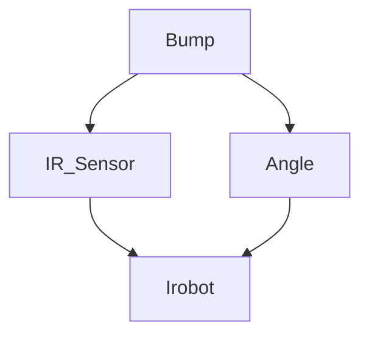
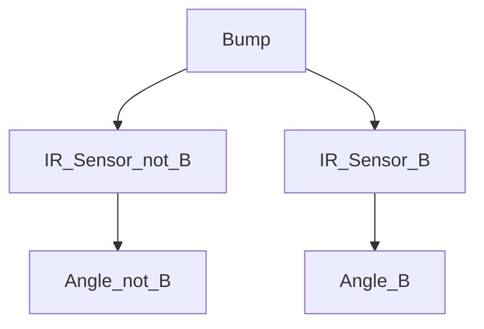

# CSE5694-IROBOT
Phi, Vamshi, Pawan

## Bayesian Network Overview

A Bayesian Network (BN), also known as a Belief Network or Probabilistic Graphical Model, is a data structure that represents the probabilistic relationships among a set of random variables. Bayesian Networks are particularly powerful for modeling uncertainty and reasoning in complex systems, making them valuable in various fields like artificial intelligence, decision support, medical diagnosis, and robotics.

Conditional Probability Distribution (CPD):
Each node in the Bayesian Network has a corresponding Conditional Probability Distribution (CPD) that quantifies the relationship between the variable and its parents. If a node has no parents, the CPD is simply its marginal probability. For nodes with parents, the CPD describes how the probability of the node varies depending on its parents' states.

## Use of Bayesian Network in Robotics**

In our project, we utilize a Bayesian Network for decision-making in a robot that must navigate and interact with its environment. Specifically, the Bayesian Network helps the robot determine whether it has just passed a door and calculate its current distance from the wall, based on sensor data.

## Step-by-Step Details of How the Network is Used on the Robot

Sensor Data Collection:
	The robot is equipped with multiple IR sensors that detect amount of infrared received bouncing light from the wall These sensors continuously collect data about the environment, such as distance to obstacles and the likelihood of detecting a door.
	The robot has built in gyroscopic sensors that allow it to read the angle that the robot is turning towards.
	The robot also has a sensor for when it bumps onto an object

Movement Control:
	The robot executes movement commands to adjust its trajectory. I tries to follow the wall and drive as perpendicular as possible. sensors can also be use to give feedback to the robot as it tries to follow the wall

Bayesian Network Integration:
	The sensor data is fed into the Bayesian Network as evidence. The network has nodes representing IR Sensor Data (IR), gyroscopic sensor data (angle), touch/contact sensor data (bump).

## Algorithm Used

The Bayesian Network is employed as part of a sensor fusion module that integrates information from multiple sensors to make probabilistic decisions. The key algorithms used are:
Belief Propagation: Used to infer the likelihood of certain states (e.g., presence of a door) based on evidence gathered by the robot’s sensors. This allows the robot to continuously update its belief state about the environment.

Value Iteration: Used for planning. The probability estimates generated by the Bayesian Network feed into the value iteration process, which determines the probabilities that the robot has seen a door.

Graph Representation of the Bayesian Network

## Summary of the Code

The code for implementing the Bayesian Network in the robot involves several key components:

Network Structure Definition: The graph structure of the Bayesian Network is defined using Python libraries. The nodes and edges are specified to represent the relationships between sensor readings and robot actions. Conditional Probability Tables (CPTs): The CPDs for each node are defined based on prior data or expert knowledge. These CPTs quantify how likely each state is given its parent nodes. For example, the probability of detecting a door given the sensor readings. The graph is inverted into an Evaluation tree that the robot can read through and process its prediction

## CPT Tables
after gathering samples, we will use Conditional Probability Tables (CPT) to define the probability that the robot has past a door.

**Bump**
| Condition | P(B) |
| :---: | :---: |
| T | 0.067 | 
| F | 0.933 |

**IR Sensor**
P(!B)
| P(D) | mean | std dev | P(IR Sensor)|
| :---: | :---: | :---: | :---: |
| T | 134 | 54.86 | 0.413 |
| F | 324.7 | 200.99 | 0.587 |

P(B)
| P(D) | mean | std dev | P(IR Sensor)|
| :---: | :---: | :---: | :---: |
| T | 172.125 | 97.2 | 0.4 |
| F | 405.41 | 391.14 | 0.6 |

**Gyrscope**
This is based on the angle fluctuations of the robot as it turns

P(!B)
| P(D) | mean | std dev | P(IR Sensor)|
| :---: | :---: | :---: | :---: |
| T | 1.692 | 1.378 | 0.413 |
| F | 1.608 | 1.227 | 0.587 |

P(B)
| P(D) | mean | std dev | P(IR Sensor)|
| :---: | :---: | :---: | :---: |
| T | 0.475 | 0.173 | 0.4 |
| F | -0.75 | 0.225 | 0.6 |

Bayesian Networks are a powerful tool for representing uncertain knowledge in an intuitive graphical form and performing probabilistic reasoning effectively. They combine graph theory and probability theory to create a flexible and robust framework for understanding complex systems.

Conclusion

Bayesian Networks provide a versatile and effective method for modeling and reasoning about uncertainty. By combining data with domain knowledge, they facilitate complex decision-making processes and offer insights into systems characterized by interdependent variables. In our robotics project, the Bayesian Network enables the robot to navigate effectively by integrating sensor data and making informed decisions. Despite challenges such as inference complexity and structure learning, their advantages in handling uncertainty, modular representation, graphical clarity, and the ability to integrate expert knowledge make them an indispensable tool in modern artificial intelligence and robotics.